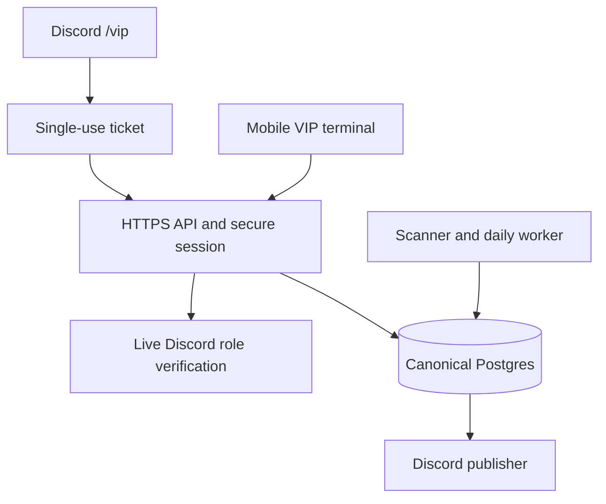

# JABBAZI GURU VIP terminal — release 1

## Architecture decision

Extend the existing FastAPI service at `/vip` with a mobile-first web application and installable PWA metadata. The same Postgres event store, scanner and Discord bot remain authoritative. No new paid services, domains, Redis, prediction pipeline or billing provider are required. Native mobile and embedded Discord Activities are not required for access.

## Security and entitlements

A fresh Discord role check authorizes `/vip` and `!vip`. The bot issues a random five-minute single-use ticket. Only SHA-256 hashes are persisted. The URL fragment never reaches the server and is removed immediately by the application before ticket exchange. A Secure, HttpOnly, SameSite=Strict `__Host-jabbazi_member` cookie holds the 15-minute session. Mutations require the exact configured HTTPS Origin.

Every protected route validates the session and live Discord authorization. Role checks cache for **at most 30 seconds** per API process. Revocation affects protected API access after that bound; visible clients recheck every 30 seconds. Failed verification after cache expiry denies access. A briefly cached role result is not a billing entitlement. Manual approved VIP-family roles continue to work without payment records.

The server owner is ADMIN. Other admin and developer grants require explicit server-side `JABBAZI_APP_ADMIN_ROLE_IDS` and `JABBAZI_APP_DEVELOPER_ROLE_IDS`. DEVELOPER gets research access but not admin controls. FREE is the denied-premium tier; public login/onboarding exists, but a personalized free account product is not in this release. Frontend values never grant entitlement. No new Discord roles are created.

API requires `JABBAZI_DISCORD_BOT_TOKEN`, guild ID and owner ID for verification. Use existing Render secrets; never put these in static files. Requests are bounded per IP/process (300/minute read access, 60/minute ticket exchange). This is not a distributed quota service. Responses and errors use no-store. Safe errors omit stack traces and credentials.

## Frontend

`terminal.html`, `terminal.css`, `terminal.js` implement progressive drill-down with five mobile navigation items: Home, Sports, Search, Watchlist, More. Sheets, Picks, Top 10, Performance and Model Center are directly available from Home/More. The renderer uses textContent, not raw HTML injection. Async responses are invalidated on logout, navigation and offline transitions. Polling is suspended for hidden documents and form views.

The service worker caches only three static assets. It never caches HTML, API data, cookies, tickets, odds or model results. Offline clears research. The app shell requests a fresh server state on reconnect. Installation behavior varies by browser; push notifications are not implemented.

## Shared research and price integrity

`research_sheet/latest_scan` is the canonical saved scan. App rows are safe projections of those records, never independent predictions. Identity uses sport, event ID/name, market, player, selection and line; books do not alter the underlying opportunity ID. Each row preserves source snapshot, model version, stage and quote timestamp. Quotes are current only for five minutes and before start time. Unhealthy, future-dated, unavailable and expired prices cannot become live official bets. Research rows stay WATCH/PASS/PRICE CHECK/QUARANTINED/INVALIDATED, never automatically BET NOW.

Official picks use the same `official_pick_embed` cash-authority, reliability, stake, execution and freshness gate as Discord. The same candidate record ID appears in deep links. A highest research probability is not designated Top Play. The release does not produce Top Play until an explicit supported designation exists.

The protected controls `pause_all` and `pause_<sport>` quarantine app research and stop **new official Main Card publication**. They do not halt ingestion, suspend model training, rewrite history, or retract already-published Discord posts. Those broader kill-switch/invalidation workflows are future work and must not be implied by the UI.

## Database schema and state

No incompatible schema migration is needed: reuse `platform_events` (id, kind, entity, occurred_at, payload JSON, sha256), existing `platform_positions` and leases. Existing append-only database triggers remain intact.

| Event kind | Entity | Payload purpose |
|---|---|---|
| member_ticket / member_session | token hash | scoped principal and expiry |
| member_ticket_used / member_session_revoked | token hash | one-use consumption / revocation |
| research_sheet | latest_scan | immutable scanner snapshot |
| daily_moneyline_sheet | Chicago date | immutable morning sheet |
| candidate | event ID | canonical official/research decision |
| vip_preferences | guild:member | units, optional bankroll, display preferences |
| vip_watchlist | guild:member | up to 100 selected opportunity IDs and optional price targets |
| vip_watch_state | guild:member | last evaluated states |
| vip_notification | guild:member | deduplicated private change alert |
| vip_controls | global | publication pause flags |
| vip_admin_audit | global | actor, timestamp, reason, before/after |
| vip_acceptance | terminal-v1 | safe production smoke-test summary |

Watchlist writes and admin flag/audit writes use the existing serializable/advisory-lock transaction path. User identity comes exclusively from the verified session. Watch evaluation runs approximately once a minute in the worker and on watchlist reads; long worker tasks can delay the background pass. Notifications are an in-app inbox, not push or DM. No automatic new Discord broadcasts are introduced.

## Sheets and daily scheduling

Reuse the independent existing America/Chicago scheduler. It attempts fresh dedicated moneyline scans during 09:00–09:14 CT with durable claims; the first healthy complete sheet freezes once. `/cheatsheet` and `/v1/vip/sheets` read the same frozen ID. The app can filter that sheet by sport and browse 90 recent publication dates. A current board and `changes` view compare later research with the frozen baseline without editing it.

This release does **not** add full multi-market per-sport 9 AM versions, isolated per-sport failure recovery, final/pregame snapshots or frozen Top 10 archives. Those require a coordinated extension of the existing publication contract, not relabeling current scans as a 9 AM release.

## Model and product support matrix

| Area | Implemented data contract | Readiness rule |
|---|---|---|
| MLB / NFL / CFB | game and supported player research from shared scanner | real snapshot only; college player markets excluded by default |
| NBA / NHL | same modular research renderer | active only when available fresh supported rows exist |
| WNBA / Tennis / Soccer | sport architecture and source projection | unavailable where the model/data source is absent |
| MLB HR / NFL ATD / NBA props / NHL scorers Top 10 | up to 10 distinct event/player rows | PRODUCTION_APPROVED stage, healthy data, fresh quote and model provenance required |
| Performance | scanner-origin ledger aggregates and periods | owner-reported provenance displayed; community/sprinkles excluded |
| CLV/calibration | existing model evaluation metadata where present | missing evidence stays unavailable; no invented CLV series |
| Alternates / Game Center | related current markets and same-player/market alternates | comparison only; no claim of safe bets |
| Promo tools | profit-boost math | user-supplied probability explicitly labeled, not a model forecast |

Current model stages must be read live. The app never promotes models to fill a list.
